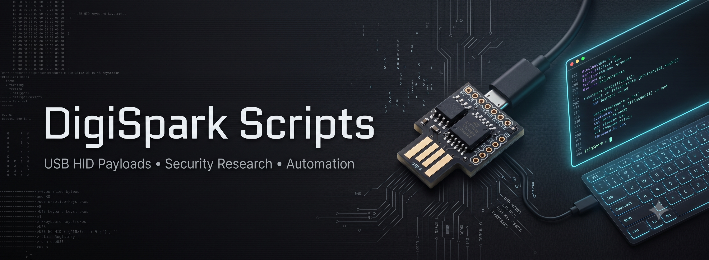

<div align="center">

<a href="https://github.com/hackyshadab/DigiSpark-Scripts">
  
</a>

# DigiSpark Scripts

### A legacy collection of USB HID / DigiSpark payloads for security research, automation, demonstrations, and controlled lab environments.

<p>
  
  
  
  
</p>

<p>
  <b>30 payload directories</b> · Arduino sketches · PowerShell · Windows · macOS · Linux · HID automation
</p>

</div>

---

## Overview

**DigiSpark Scripts** is a collection of small HID-based payloads built around the DigiSpark and the `DigiKeyboard.h` library.

The repository began as a hands-on collection of Rubber Ducky-style ideas converted to DigiSpark-compatible sketches. It contains a mixture of **security-testing experiments, system automation, demonstrations, and harmless prank payloads**, along with several legacy offensive-security examples.

The code is intentionally lightweight and easy to inspect, modify, and study.

> **Project status:** Legacy collection. Many payloads were written several years ago and may require modification for modern operating systems, browsers, security controls, keyboard layouts, or network environments.

---

## ⚠️ Responsible Use

Some payloads in this repository interact with credentials, system configuration, network services, administrator privileges, persistence mechanisms, or remote shells.

Use these scripts **only on systems and networks you own or are explicitly authorized to test**. For experimentation, prefer an isolated VM, disposable test machine, or dedicated lab environment.

This repository is provided for **education, security research, red-team/blue-team labs, and controlled demonstrations**. The maintainer is not responsible for misuse, data loss, system instability, or unauthorized access.

Before deploying any payload, read the source and understand exactly what it does.

---

## What is a DigiSpark?

The DigiSpark is a small ATtiny85-based development board that can emulate a USB keyboard using libraries such as `DigiKeyboard`.

That makes it useful for exploring concepts such as:

- USB HID automation
- Keyboard injection and scripting
- Security-awareness demonstrations
- Red-team / blue-team lab exercises
- Desktop automation
- Embedded security experiments

The interesting part is the simplicity: the device can turn a short Arduino sketch into a sequence of keyboard actions performed on the connected host.

---

## Repository Structure

```text
DigiSpark-Scripts/
├── DigiSpark-all-Scripts/
│   ├── Chrome password stealer/
│   ├── Create_Account/
│   ├── DNS Poisoner/
│   ├── Disable Window Defender/
│   ├── Execute_Powershell_Script/
│   ├── Fork_Bomb/
│   ├── Hi_Chewy/
│   ├── Keylogger/
│   ├── Reverse_Shell/
│   ├── WiFi_Profile_Grabber/
│   ├── Wallpaper_Changer/
│   └── ...
├── LICENSE
└── README.md
```

Each payload is kept in its own directory. Depending on the payload, the folder may contain an `.ino` sketch, a text payload, a PowerShell script, a helper shell script, or supporting files.

---

## Payload Collection

### 🧪 Security / Offensive-Security Research

| Payload | Purpose / Concept | Platform |
|---|---|---|
| `Chrome password stealer` | Legacy browser-credential extraction experiment | Windows |
| `Create_Account` | Creates a local account and modifies local administrator membership | Windows |
| `Disable Window Defender` | Legacy security-control tampering experiment | Windows |
| `DNS Poisoner` | Modifies the Windows hosts file to redirect selected domains | Windows |
| `Execute_Powershell_Script` | Downloads and launches a PowerShell script | Windows |
| `Keylogger` | Runs a short PowerShell-based keystroke-capture experiment | Windows |
| `Netcat-Revershell` | Legacy reverse-shell payload concept | Windows / Linux |
| `Payload Android Pin bruteforce` | Automated PIN-entry demonstration | Android |
| `Payload FTP Download Upload` | FTP-based file transfer automation | Windows |
| `Payload Remotely Possiable` | Legacy remote-access / configuration experiment | Windows |
| `Rapid_Shell` | Legacy Metasploit payload execution experiment | Windows |
| `Reverse_Shell` | PowerShell-based reverse-shell experiment | Windows |
| `WiFi_Profile_Grabber` | Extracts saved Wi-Fi profile information | Windows |
| `WiFi_Profile_Mailer` | Collects Wi-Fi profile data and sends a report through SMTP | Windows |
| `Fork_Bomb` | Process-spawning / resource-exhaustion demonstration | Windows |

### 🎭 Demonstrations & Pranks

| Payload | Purpose / Concept | Platform |
|---|---|---|
| `Fake Update Screen` | Displays a fake update-style page | Windows |
| `Hi_Chewy` | Delayed audio prank using a downloaded sound file | Windows |
| `Linux youtube blaster` | Opens a terminal workflow and launches a YouTube video | Linux / Unix-like |
| `Payload Rickroll` | Opens the classic Rick Astley video | General |
| `Payload youtube roll` | Opens a YouTube Rickroll | General |
| `RickRoll_Update` | Combines a Rickroll with a fake update screen | Windows |
| `Payload mobiletabs` | Opens multiple browser tabs | Windows |
| `Payload paint hack` | Demonstration / drawing sequence in Paint | Windows |
| `Silly_Mouse` | Changes mouse-related settings for a prank/demo | Windows |
| `Talker` | Uses PowerShell speech synthesis to speak a message | Windows |
| `Wallpaper_Changer` | Downloads and applies a wallpaper | Windows |
| `Wallpaper_Changer_macOS` | Downloads and applies a wallpaper through macOS Terminal / AppleScript | macOS |
| `Wallpaper_Prank` | Captures the desktop and uses it as a wallpaper | Windows |
| `Window_Jammer` | Repeatedly sends window-closing key combinations | Windows |
| `Payload Windows 10 Download & Change Wallpaper` | Downloads and changes the wallpaper | Windows |

> Some entries are clearly benign demonstrations; others are intentionally included as historical security research examples. Treat the entire collection as **code to inspect before execution**, not as a plug-and-play production toolkit.

---

## Getting Started

### 1. Prepare the environment

Install the Arduino IDE and configure it for DigiSpark / Digistump support. Make sure the `DigiKeyboard` library is available to the selected board configuration.

### 2. Choose a payload

Browse `DigiSpark-all-Scripts/` and select the sketch or payload you want to study.

### 3. Read the source first

Check the comments, operating-system assumptions, URLs, paths, credentials/placeholders, delays, privileges, and external dependencies before compiling anything.

### 4. Adapt for your lab

Many of the original payloads assume specific Windows versions, keyboard layouts, administrator access, network services, or legacy software behavior. Update those assumptions for your test environment.

### 5. Compile and test safely

Use a controlled machine or isolated lab. Never connect an unknown payload to a production workstation or a system containing real credentials or sensitive data.

---

## Compatibility Notes

Because this is a legacy collection, compatibility is not uniform.

Common factors that can affect execution include:

- Windows version and build
- PowerShell version and policy settings
- UAC behavior and administrator privileges
- Keyboard layout, especially non-QWERTY layouts
- Browser changes and UI redesigns
- Defender / EDR behavior
- Network access and external URLs
- Availability of `netsh`, FTP, Netcat, Metasploit, or other dependencies
- macOS / Linux desktop behavior
- Timing and USB enumeration speed

A payload that worked on a machine years ago may fail, behave differently, or trigger modern security controls today.

---

## Design Notes

Most sketches follow the same basic pattern:

```text
DigiSpark connected
       │
       ▼
USB HID keyboard initialization
       │
       ▼
Keystrokes / text / shortcuts
       │
       ▼
Host-side command or application
       │
       ▼
Demonstration / automation / security action
```

The collection is useful for learning how seemingly simple HID input can bridge embedded hardware and host-side scripting.

---

## Credits & Attribution

The repository contains a mixture of original sketches, conversions, adaptations, and legacy community payloads. Several files include their own attribution or source references; those references have been preserved in the relevant files where available.

Notable references appearing in the collection include:

- **Hak5 / USB Rubber Ducky** — DuckyScript concepts and payload inspiration
- **Digistump** — DigiSpark / `DigiKeyboard` ecosystem
- **Nishang / samratashok** — PowerShell networking / shell components referenced by legacy payloads
- **CedArctic / digiQuack** — payload conversion tooling referenced by some sketches
- Other individual contributors are credited inside the respective source files where attribution was available

Please preserve original file-level credits when modifying or redistributing individual payloads.

---

## Resources

- [DigiSpark Arduino Integration](https://github.com/digistump/DigisparkArduinoIntegration)
- [DigiKeyboard library](https://github.com/digistump/DigisparkArduinoIntegration/tree/master/libraries/DigisparkKeyboard)
- [USB HID Usage Tables](https://www.usb.org/hid)
- [Hak5 USB Rubber Ducky](https://github.com/hak5darren/USB-Rubber-Ducky)
- [Apache License 2.0](LICENSE)

---

## Contributing

Contributions are welcome, especially improvements that make the collection safer and easier to learn from.

Useful contributions include:

- Fixing broken or outdated payloads
- Adding clear comments and documentation
- Improving compatibility notes
- Adding defensive / blue-team demonstrations
- Replacing dead external dependencies
- Documenting known limitations and test environments

For payload changes, explain the expected behavior and test environment in the pull request.

---

## Disclaimer

This project is intended for **authorized security testing, education, research, and controlled demonstrations**. Some included payloads can modify system state, access sensitive information, create resource exhaustion, or establish remote access when configured to do so.

Do not use this project against systems you do not own or have explicit permission to test.

---

<div align="center">

### ⭐ Found something useful?

If this collection helped you learn about USB HID, DigiSpark, or security testing, consider giving the repository a star.

<sub>Built as a hands-on DigiSpark / HID scripting collection and preserved as a legacy security research archive.</sub>

</div>
